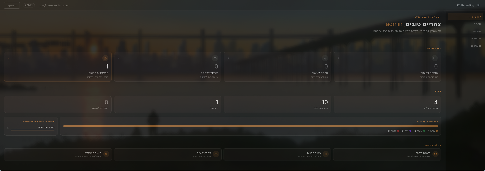
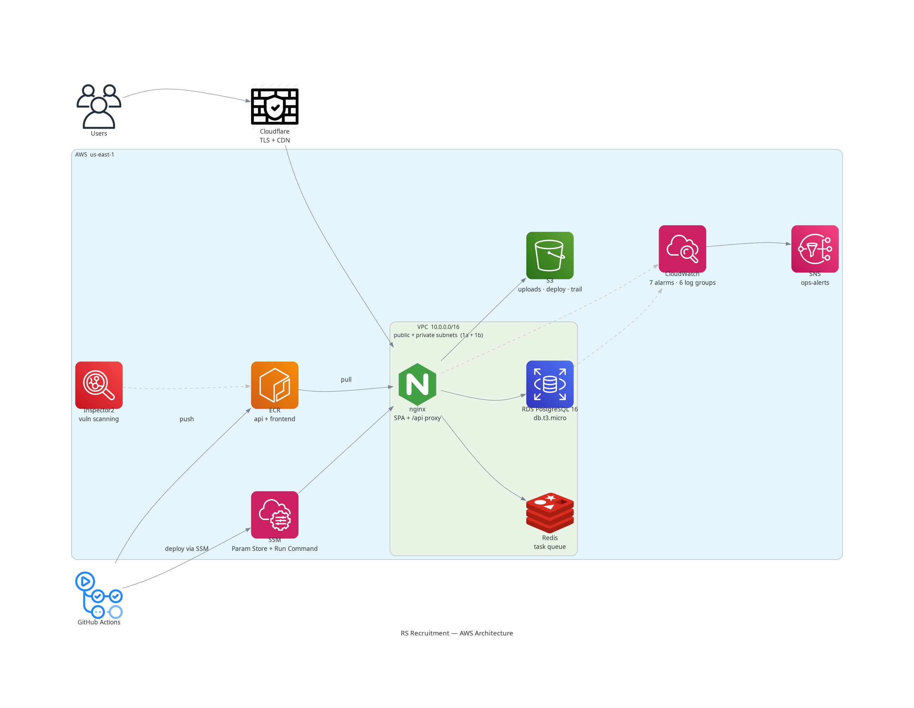
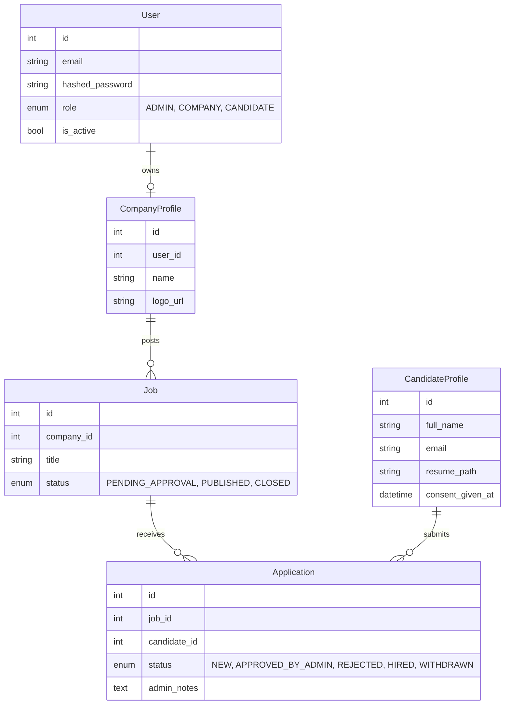

# RS Recruitment

A full-stack recruitment CRM built for a boutique agency. Manages the full pipeline from company onboarding and job posting through candidate applications to admin-gated match decisions — with a dark luxury React frontend served over a production AWS stack.

**Live:** [rs-recruiting.com](https://rs-recruiting.com)


<p><em>Public-facing site — landing page, job board, and candidate application flow</em></p>


<p><em>Admin dashboard — live stats across companies, jobs, applications, and candidates with quick-action shortcuts</em></p>

---

## Features

**Public**
- Job board with per-job detail pages and JSON-LD `JobPosting` structured data
- Candidate application form with resume upload (PDF/DOCX → S3)
- GDPR-style consent tracking: timestamp, policy version, IP, user-agent stored per submission
- SEO: dynamic sitemap.xml, robots.txt, Open Graph meta, server-side prerendered OG pages

**Admin**
- Invite-based company onboarding (token → registration → approval → activation)
- Job approval queue (review, approve, or reject postings)
- Application management with status tracking (New → Approved → Hired/Rejected)
- Candidate directory with profile and resume access
- Append-only audit log: every admin action is recorded with actor, target, IP, and timestamp

**Company**
- Job posting and management dashboard
- View applications per job

**Auth**
- JWT access token (30 min) + HttpOnly refresh cookie (7 days)
- Role-based route guards (ADMIN / COMPANY / public)
- Account lockout after 5 failed attempts (15-min Redis-backed cooldown)
- JWT blacklisting on logout via JTI stored in Redis

---

## Tech Stack

| Layer | Technologies |
|---|---|
| Frontend | React 19, TypeScript, Vite, Tailwind CSS v4, React Router v7 |
| Backend | FastAPI, SQLModel (SQLAlchemy + Pydantic), Alembic, Python 3.12 |
| Database | PostgreSQL 16, asyncpg (connection pool + pre-ping) |
| Background Jobs | Arq + Redis (async task queue, retry logic) |
| File Storage | AWS S3 (production), local filesystem (dev) — provider abstraction |
| Email | AWS SES / SMTP — same abstraction pattern as storage; 10+ HTML templates |
| Auth | JWT (python-jose), bcrypt, HttpOnly refresh cookie, slowapi rate limiting |
| Observability | Sentry (backend + frontend with source maps), Google Tag Manager, CloudWatch |
| Infrastructure | EC2 + RDS + S3 + ECR + SSM, Cloudflare (TLS + CDN) |
| CI/CD | GitHub Actions — OIDC auth, change detection, Pytest against PostgreSQL, SSM deploy |
| Code Quality | Ruff, ESLint, TypeScript strict, 5 custom validation scripts, weekly pip-audit |

---

## Architecture



<p><em>Request path: Users → Cloudflare → nginx → RDS / Redis / S3. CI/CD path: GitHub Actions → ECR (Docker images) + SSM Run Command → EC2. Observability: CloudWatch alarms → SNS ops-alerts; Inspector2 scanning ECR images. All secrets live in SSM Parameter Store as SecureStrings.</em></p>

### Data model



---

## Design Decisions

**Hybrid authentication** — Admins and companies are authenticated users; candidates are anonymous leads. This reduces auth surface area and keeps the apply flow frictionless. The schema leaves `user_id` nullable on `CandidateProfile` so a future "claim your application" flow is non-breaking.

**Redis failure policy: fail-closed vs. fail-open** — Different operations have different risk profiles. JWT blacklist reads/writes and invite-token validation are fail-closed (return HTTP 503 if Redis is down) because allowing a revoked token through is a security breach. Brute-force lockout checks are fail-open (log the error, allow the request) because blocking all logins during a Redis blip is worse than a missed lockout. The health endpoint returns `200 degraded` when Redis is unreachable so uptime monitors can distinguish "down" from "degraded."

**JWT blacklisting on logout** — Stateless JWTs can't be revoked, so each token embeds a `jti` claim. On logout, the JTI is written to Redis with a TTL matching the token's remaining lifetime. Every authenticated request checks the blacklist. Refresh tokens are also hashed and stored in the DB with an `is_revoked` flag for single-use rotation.

**Storage and email abstraction** — Both file storage and email are behind provider interfaces. A single env var switches between local/S3 and SMTP/SES with no code changes. This made local development cheap and production deployment straightforward.

**Async task queue for email** — Sending email from inside a request handler risks timeouts and drops on provider throttling. All outbound email is pushed to an Arq/Redis queue and processed by a separate worker container with retry logic. Ten transactional templates cover the full company and candidate lifecycle, all matching the dark luxury frontend design.

**OIDC-based CI/CD with change detection** — GitHub Actions authenticates to AWS via OIDC (no stored credentials). A `detect-changes` job skips irrelevant work — a docs-only PR never runs backend tests or builds Docker. The deploy workflow supports manual re-deploy by SHA, checks if an ECR image already exists before rebuilding, and polls SSM run-command status rather than fire-and-forget. Deployments are never cancelled mid-flight.

**Custom CI validation scripts** — Beyond Ruff and TypeScript, five custom scripts run in CI: SOC import enforcement (services must not import FastAPI), blocking I/O detection in async functions (catches `open()`, `requests.*`, `time.sleep()`), type hint coverage on public functions, test file existence checks (1:1 mapping with source files), and file size limits. Catches architecture drift that standard linters miss.

**Docker hardening** — Multi-stage build with layer caching on the lockfile. Runtime image runs as a non-root `appuser` (permissions fixed in entrypoint script). Dev and test dependencies are excluded. Health check hits the `/health` endpoint via the same proxy path a real client uses.

**SEO prerendering for a SPA** — Client-side React can't be indexed for job-specific pages. The backend generates server-side HTML snapshots with full Open Graph meta, canonical URLs, and JSON-LD `JobPosting` structured data (title, salary range, location, dates). A dynamic sitemap.xml lists all published jobs with `lastmod` from `updated_at`. Googlebot gets a real HTML response; users get the SPA.

**Hebrew-only RTL UI** — The entire frontend is in Hebrew with `<html dir="rtl">` forced globally. All UI strings live in a single `he.json` locale file; raw backend error strings are never surfaced to the user.

---

## Testing

30+ test files, ~14k lines, parallel execution via `pytest-xdist` (each worker gets a dedicated database).

```
tests/
├── models/       # ORM model validation
├── services/     # Business logic (auth, admin, company, public flows)
├── api/          # Endpoint tests (SEO, Sentry tunnel)
├── templates/    # Email template rendering
└── core/         # Task queue, Redis fail-closed behavior
```

Notable coverage: full auth lifecycle (invite → registration → approval → activation → login → lockout → logout), SEO output (sitemap, JSON-LD, OG prerender), Redis failure scenarios (fail-closed vs. fail-open paths tested independently).

```bash
uv run pytest -n auto
```

---

## Local Development

**Prerequisites:** Python 3.12+, [uv](https://github.com/astral-sh/uv), Docker + Docker Compose, Node 18+

```bash
# 1. Clone and install
git clone https://github.com/lahavrud/rs-recruitment.git
cd rs-recruitment
uv sync

# 2. Start services (PostgreSQL + Redis)
docker-compose up -d

# 3. Run migrations
uv run alembic upgrade head

# 4. Start backend
uv run uvicorn src.main:app --reload

# 5. Start frontend (separate terminal)
cd frontend
npm install
npm run dev
```

The frontend proxies `/api/*` to `http://localhost:8000`.

### Environment

```bash
# Minimum required
export JWT_SECRET_KEY=$(python3 -c "import secrets; print(secrets.token_urlsafe(32))")
```

See `.env.example` for the full list of optional variables (email provider, S3 config, etc.).

### Linting

```bash
uv run ruff check . && uv run ruff format --check .
cd frontend && npx tsc --noEmit && npm run lint
```

---

## Project Structure

```
rs-recruitment/
├── src/
│   ├── api/          # Thin FastAPI routers (auth, admin, company, public, seo)
│   ├── services/     # Business logic, decoupled from routers
│   │   ├── auth/     # session, registration, activation, password_reset
│   │   ├── admin/    # companies, jobs, applications, candidates, invites, audit
│   │   ├── company/  # jobs, profile, candidates
│   │   └── utils/    # audit logging, contract PDF, legal text
│   ├── core/         # storage, email, task queue, Redis pool
│   ├── models.py     # SQLModel ORM models
│   └── templates/    # Transactional email templates (HTML)
├── frontend/src/
│   ├── pages/        # public/, admin/, company/ + auth pages
│   ├── components/   # layout/, guards/, ui/
│   ├── hooks/        # useAuth, useInfiniteList, useDebounce, usePageTitle…
│   └── locales/      # he.json (all UI strings)
├── tests/            # 30+ test files, pytest-xdist parallel execution
├── scripts/          # 5 CI validation scripts
├── docs/             # Architecture decisions, infrastructure, roadmap
└── .github/workflows/
    ├── ci.yml        # Lint, test, docker-build (change-aware)
    ├── deploy.yml    # Build + deploy to production (OIDC + SSM)
    └── security-audit.yml  # Weekly pip-audit for CVEs
```
