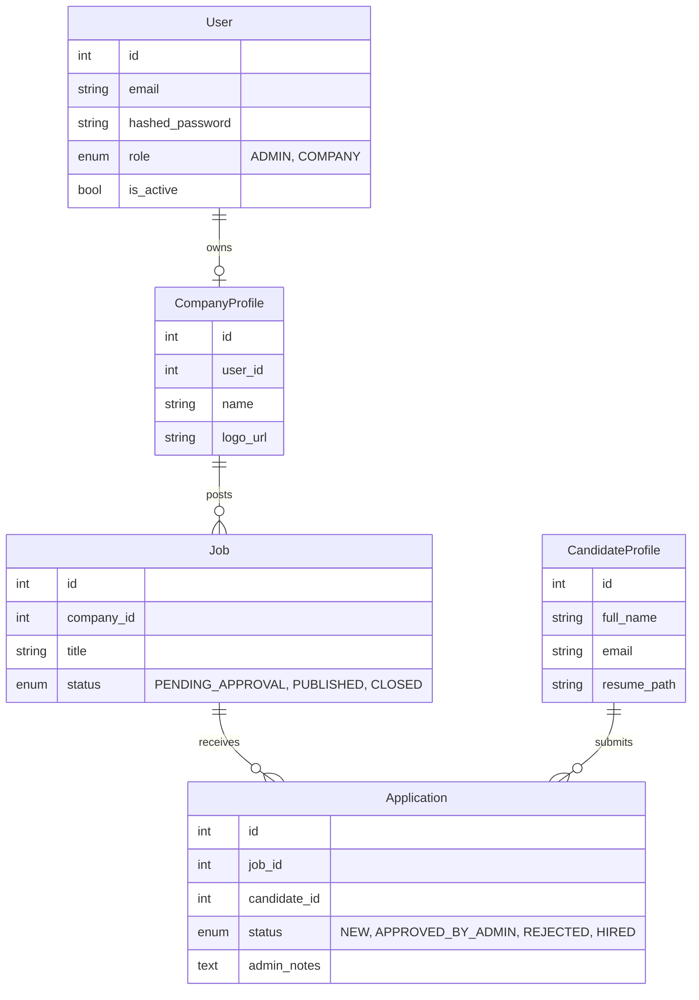

# RS Recruitment

A full-stack recruitment CRM built for a boutique agency. Manages the full pipeline from company onboarding and job posting through candidate applications to admin-gated match decisions — with a dark luxury React frontend served over a production AWS stack.

**Live:** [rs-recruiting.com](https://rs-recruiting.com)

---

## Features

**Public**
- Job board with per-job detail pages
- Candidate application form with resume upload (PDF/DOCX → S3)
- SEO-optimized pages with Open Graph meta and structured data

**Admin**
- Company approval queue (invite-based onboarding)
- Job approval queue (review, approve, or reject postings)
- Application management with status tracking (New → Approved → Hired/Rejected)
- Candidate directory with profile and resume access

**Company**
- Job posting and management dashboard
- View applications per job

**Auth**
- JWT access token + HttpOnly refresh cookie
- Role-based route guards (ADMIN / COMPANY / public)
- Invite-only company registration with token activation

---

## Tech Stack

| Layer | Technologies |
|---|---|
| Frontend | React 19, TypeScript, Vite, Tailwind CSS v4, React Router v7 |
| Backend | FastAPI, SQLModel (SQLAlchemy + Pydantic), Alembic, Python 3.12 |
| Database | PostgreSQL 16, asyncpg |
| Background Jobs | Arq + Redis (async task queue) |
| File Storage | AWS S3 (production), local filesystem (dev) — provider abstraction |
| Email | AWS SES / SMTP — same abstraction pattern as storage |
| Auth | JWT (python-jose), HttpOnly refresh cookie |
| Infrastructure | EC2 + RDS + S3 + ECR, Cloudflare (TLS + CDN) |
| CI/CD | GitHub Actions — OIDC auth, Pytest against PostgreSQL, SSM deploy |
| Code Quality | Ruff, ESLint, TypeScript strict, 5 custom validation scripts |

---

## Architecture

```
Browser
  │
Cloudflare (TLS, CDN)
  │
EC2 — nginx
  ├── React SPA (static, S3-built)
  └── /api → FastAPI
            ├── PostgreSQL (RDS, private subnet)
            ├── Redis → Arq worker (background emails)
            └── S3 (resume uploads)
```

### Data model



---

## Design Decisions

**Hybrid authentication** — Admins and companies are authenticated users; candidates are anonymous leads. This reduces auth surface area and keeps the apply flow frictionless. The schema leaves `user_id` nullable on `CandidateProfile` so a future "claim your application" flow is non-breaking.

**Storage and email abstraction** — Both file storage and email are behind provider interfaces. A single env var switches between local/S3 and SMTP/SES with no code changes. This made local development cheap and production deployment straightforward.

**Async task queue for email** — Sending email from inside a request handler risks timeouts and drops on provider throttling. All outbound email is pushed to an Arq/Redis queue and processed by a separate worker container with retry logic.

**OIDC-based CI/CD** — GitHub Actions authenticates to AWS via OIDC (no stored credentials). The deploy script derives the ECR registry and S3 bucket from the EC2 IAM role at runtime — nothing is hardcoded. A failed deploy is detectable via SSM run command polling.

**Custom CI validation scripts** — Beyond Ruff and TypeScript, five custom scripts run in CI: SOC import enforcement, blocking I/O detection in async functions, type hint coverage on public functions, test file existence checks, and file size limits. Catches architecture drift that linters miss.

**Hebrew-only RTL UI** — The entire frontend is in Hebrew with `<html dir="rtl">` forced globally. All UI strings live in a single `he.json` locale file; raw backend error strings are never surfaced to the user.

---

## Local Development

**Prerequisites:** Python 3.12+, [uv](https://github.com/astral-sh/uv), Docker + Docker Compose, Node 18+

```bash
# 1. Clone and install
git clone https://github.com/lahavrud/rs-recruitment.git
cd rs-recruitment
uv sync

# 2. Start services (PostgreSQL + Redis)
docker-compose up -d

# 3. Run migrations
uv run alembic upgrade head

# 4. Start backend
uv run uvicorn src.main:app --reload

# 5. Start frontend (separate terminal)
cd frontend
npm install
npm run dev
```

The frontend proxies `/api/*` to `http://localhost:8000`.

### Environment

```bash
# Minimum required
export JWT_SECRET_KEY=$(python3 -c "import secrets; print(secrets.token_urlsafe(32))")
```

See `.env.example` for the full list of optional variables (email provider, S3 config, etc.).

### Running tests

```bash
uv run pytest -n auto
```

### Linting

```bash
uv run ruff check . && uv run ruff format --check .
cd frontend && npx tsc --noEmit && npm run lint
```

---

## Project Structure

```
rs-recruitment/
├── backend/src/
│   ├── api/          # Thin FastAPI routers (auth, admin, company, public, seo)
│   ├── services/     # Business logic, decoupled from routers
│   ├── models.py     # SQLModel ORM models
│   └── main.py       # App factory, middleware, router registration
├── frontend/src/
│   ├── pages/        # public/, admin/, company/ + auth pages
│   ├── components/   # layout/, guards/, ui/
│   ├── contexts/     # AuthContext
│   └── locales/      # he.json (all UI strings)
├── scripts/          # CI validation scripts
├── docs/             # Architecture decisions, infrastructure, roadmap
└── .github/workflows/
```
