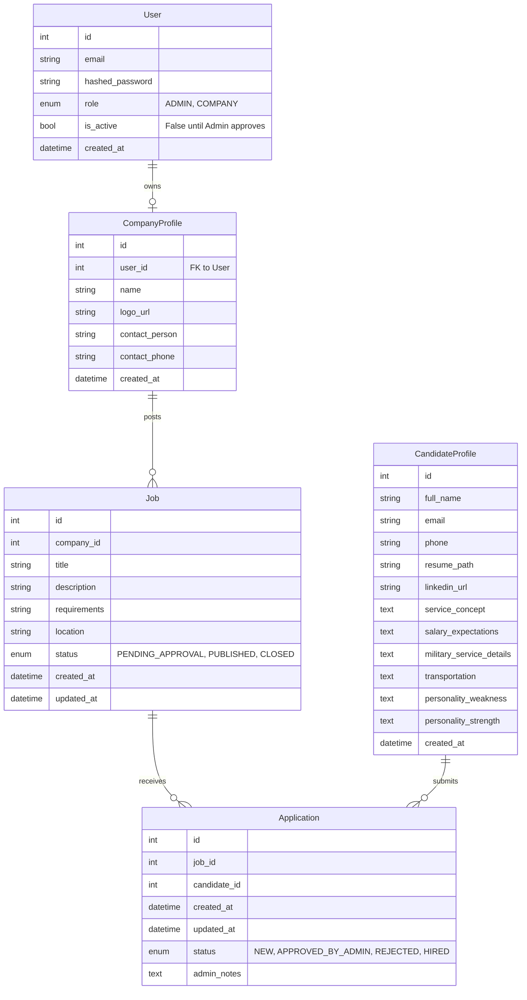

# Architecture Decisions

This document captures all architectural decisions made for the RS Recruitment MVP, with references to GitHub Issues where decisions were discussed and implemented.

---

## Table of Contents

1. [Design Principles](#design-principles)
2. [Authentication Model](#authentication-model)
3. [Infrastructure Decisions](#infrastructure-decisions)
4. [Frontend Architecture](#frontend-architecture)
5. [Backend Architecture](#backend-architecture)
6. [Database Schema](#database-schema)
7. [Deployment & DevOps](#deployment--devops)
8. [Code Quality & Standards](#code-quality--standards)

---

## Design Principles

These principles guide all architectural decisions:

- **Monolith First** – Single deployable service with clear domain boundaries
- **Vertical Slices** – Features are developed end-to-end (DB → Business Logic → API → Tests)
- **Admin as Gatekeeper** – All public data requires admin approval
- **Match is the Product** – The Application entity is the system core
- **Low friction MVP** – Minimal auth surface, minimal public access
- **Future-ready** – Decisions documented, refactors anticipated
- **Architecture-First** – Critical infrastructure decisions made before dependent features

**Related Issues:**
- [#15](https://github.com/lahavrud/rs-recruitment/issues/15) - docs: setup project architecture, roadmap, and ai context

---

## Authentication Model

### Hybrid Auth Model

**Decision:** Implement a hybrid authentication model where authenticated Users (Admins and Companies) can log in, while Candidates remain unauthenticated leads.

**Rationale:** This model reduces security risk and complexity while keeping the system flexible for future enhancements.

**Implementation:**
- **Users** authenticate and log in
  - Admins (role: `ADMIN`)
  - Companies (role: `COMPANY`)
- **Candidates** do NOT authenticate
  - They are treated as leads / data entities
  - Future authentication is optional and non-breaking

**Related Issues:**
- [#25](https://github.com/lahavrud/rs-recruitment/issues/25) - feat: minimal auth system (registration + login)
- [#23](https://github.com/lahavrud/rs-recruitment/issues/23) - feat: company onboarding (auth + db)

**Status:** ✅ Implemented

---

## Infrastructure Decisions

### 1. File Storage Strategy

**Problem:** `CandidateProfile.resume_path` implies file storage, but Docker containers are ephemeral. Local file storage will be lost on container restart/redeploy.

**Decision:** Implement a storage abstraction layer supporting multiple providers (Local, S3, MinIO) to enable resume uploads without vendor lock-in.

**Options Considered:**
- **AWS S3** – Production-ready, scalable, pay-per-use
- **Cloudinary** – Image/document optimization built-in
- **MinIO** – Self-hosted S3-compatible, good for dev/staging
- **Local Volume Mount** – Only for development, not production

**Chosen Solution:** Storage abstraction layer with provider abstraction interface
- **Local Storage** – For development and tests (`src/core/services/storage.py::LocalStorageProvider`)
- **S3/MinIO Storage** – For production (`src/core/services/storage.py::S3StorageProvider`)
- Provider selection via `STORAGE_PROVIDER` environment variable (`local` or `s3`)

**Implementation:**
- Abstract base class: `StorageProvider` in `src/core/services/storage.py`
- Methods: `upload_file()`, `get_file_url()`, `delete_file()`
- File validation: Size limits and file type checking
- Configuration: `src/core/infrastructure/config.py` with `storage_provider`, `aws_s3_bucket_name`, `local_storage_path`

**Related Issues:**
- [#43](https://github.com/lahavrud/rs-recruitment/issues/43) - feat(infra): Implement storage abstraction layer for file uploads (S3/MinIO/Local) ✅ CLOSED
- [#30](https://github.com/lahavrud/rs-recruitment/issues/30) - infra: integrate AWS S3 and SES services ✅ CLOSED

**Status:** ✅ Implemented

---

### 2. Email/Notification Service

**Problem:** Notifications are scheduled late (Phase 4), but admins need real-time alerts when candidates apply. Without email service, admins must manually refresh dashboard.

**Decision:** Integrate email service early (Infrastructure phase) with async task processing for guaranteed delivery.

**Options Considered:**
- **SMTP (Gmail/SendGrid)** – Simple, reliable, works with any provider
- **SendGrid API** – Transactional email service, better deliverability
- **AWS SES** – Cost-effective at scale
- **Postmark** – Developer-friendly, great deliverability

**Chosen Solution:** Email abstraction layer with async task queue (Arq + Redis)
- **Email Providers:** Abstract interface supporting SES and SMTP (`src/core/services/email.py`)
- **Task Queue:** Arq with Redis for async email processing (`src/core/tasks.py`)
- **Retry Logic:** Automatic retries for failed email sends
- Provider selection via `EMAIL_PROVIDER` environment variable (`ses` or `smtp`)

**Implementation:**
- Abstract base class: `EmailProvider` in `src/core/services/email.py`
- Implementations: `SESEmailProvider`, `SMTPEmailProvider`
- Async task: `send_email_task()` in `src/core/tasks.py`
- Redis integration: Redis service in `docker-compose.yml`
- Configuration: `src/core/infrastructure/config.py` with email provider settings

**Notification Triggers:**
- New candidate application → Email admin
- Company registration → Email admin (approval needed)
- Job posted → Email admin (approval needed)
- Application status changed → Email candidate/company

**Related Issues:**
- [#44](https://github.com/lahavrud/rs-recruitment/issues/44) - feat(infra): Implement async task processing with Arq for guaranteed email delivery ✅ CLOSED
- [#30](https://github.com/lahavrud/rs-recruitment/issues/30) - infra: integrate AWS S3 and SES services ✅ CLOSED
- [#90](https://github.com/lahavrud/rs-recruitment/issues/90) - feat8: Notifications Integration (pending)

**Status:** ✅ Implemented (email service), 🔄 Pending (notification integration)

---

### 3. Async Background Jobs (Task Queue)

**Problem:** Standard HTTP requests must return quickly. Long-running tasks (like sending emails or processing files) will cause API timeouts and poor user experience.

**Decision:** Implement an asynchronous background worker queue using Redis and Arq.

**Chosen Solution:**
- **Broker:** Redis (In-memory data store, extremely fast for message queuing).
- **Worker:** Arq (Python library specifically designed for asyncio and Redis).

**Implementation:**
- **Task Definition:** Tasks are defined as standard async Python functions in `src/core/tasks.py`.
- **Worker Process:** A separate Docker container runs the Arq worker process to consume tasks off the Redis queue.
- **API Integration:** The FastAPI endpoints push job payloads to Redis and immediately return `201 Created` or `200 OK` to the user.
- **Resilience:** Built-in retry logic ensures transient failures (like AWS SES throttling) do not result in dropped tasks.

**Status:** ✅ Implemented

---

### 4. Containerization Strategy

**Problem:** Need consistent runtime environment across all stages (Dev, Test, Prod) to avoid "it works on my machine" issues.

**Decision:** Containerize the application using Docker with multi-stage builds for optimized image size.

**Implementation:**
- **Dockerfile:** Multi-stage build with Python 3.12 base image
- **docker-compose.yml:** Includes API service, Redis service, and Arq worker
- **Health Checks:** Configured for all services
- **Volume Mounts:** Persistent data storage for SQLite (dev) and local storage

**Related Issues:**
- [#9](https://github.com/lahavrud/rs-recruitment/issues/9) - Containerize application with docker ✅ CLOSED

**Status:** ✅ Implemented

---

### 5. CI/CD Pipeline

**Problem:** Need automated quality checks, testing against production-identical database, and zero-touch deployment on every push to main.

**Decision:** GitHub Actions CI/CD with OIDC-based AWS authentication, PostgreSQL service container for tests, and SSM Run Command for keyless deployment.

**Implementation:**
- **Workflow:** `.github/workflows/ci.yml`
- **On pull_request to main:**
  - `lint`: Ruff linter + formatter + 5 custom validation scripts
  - `test`: Pytest against a PostgreSQL 16 service container (dialect parity with production)
  - `docker-build`: Build image and verify `/health` endpoint
- **On push to main (after lint + test pass):**
  - `lint` + `test`: (same as above)
  - `deploy`: OIDC auth → ECR push (`:latest` + `:<sha>`) → frontend build → S3 upload → SSM Run Command → poll until complete
- **Authentication:** GitHub Actions OIDC — role `github-actions-rs-recruitment` (no stored AWS credentials)
- **Deploy Script:** `scripts/deploy_ec2.sh` runs on EC2 via SSM; derives ECR registry and S3 bucket from the EC2 IAM role at runtime (nothing hardcoded)
- **Validation Scripts:**
  - `validate_imports.py` - SOC enforcement (separation of concerns)
  - `check_file_sizes.py` - File size limits
  - `validate_type_hints.py` - Type hint validation
  - `validate_blocking_io.py` - Blocking I/O detection in async functions
  - `validate_test_files.py` - Test file existence checks

**Related Issues:**
- [#21](https://github.com/lahavrud/rs-recruitment/issues/21) - infra: ci/cd pipeline ✅ CLOSED
- [#80](https://github.com/lahavrud/rs-recruitment/issues/80) - chore(infra): Add type hints, blocking I/O, and test file validation to CI ✅ CLOSED
- [#97](https://github.com/lahavrud/rs-recruitment/issues/97) - deploy1: Production Deployment ✅ CLOSED

**Status:** ✅ Implemented

---

## Frontend Architecture

### 1. Frontend Architecture Decision

**Problem:** Roadmap mentions "Public Job Board" and "Admin Dashboard" but doesn't specify if FastAPI serves HTML or acts as headless API.

**Decision:** Use a separate SPA (Single Page Application) with FastAPI as a headless API.

**Options Considered:**

**A. Server-Side Rendering (SSR) with Jinja2**
- FastAPI serves HTML templates
- Simpler deployment (single service)
- SEO-friendly
- Less interactive, harder to scale frontend separately

**B. Separate SPA (React/Vue/Svelte)** ✅ **CHOSEN**
- FastAPI as headless API only
- Better UX, more interactive
- Separate deployment, CORS configuration needed
- Better for future mobile apps

**C. Hybrid (SSR + API)**
- FastAPI serves public pages (SSR)
- Admin/Company dashboards as SPA
- More complex but flexible

**Rationale:** Better separation of concerns, easier to scale frontend independently, better UX for dashboards.

**API Structure:** All endpoints return JSON. Frontend consumes REST API with JWT authentication.

**Implementation:**
- **Framework:** React 19 + TypeScript (via Vite)
- **Styling:** Tailwind CSS v4
- **Routing:** React Router v7
- **API Client:** Axios with JWT interceptors
- **Auth Flow:** JWT access token in `localStorage`, refresh token in HttpOnly cookie issued by backend. `AuthContext` resolves initial state synchronously from `localStorage` then verifies via `/api/auth/me`. Verified server-side on every request.
- **Dev Server:** Vite with proxy `/api/* → http://localhost:8000`

**Routes:**
| Path | Component | Guard | Description |
|------|-----------|-------|-------------|
| `/` | LandingPage | — | Public landing page |
| `/login` | LoginPage | — | JWT login form |
| `/register` | RegisterPage | — | Company self-registration (pending approval) |
| `/activate` | ActivatePage | — | Invite-token activation (set password) |
| `/jobs` | JobBoardPage | — | Published job listings |
| `/jobs/:id` | JobDetailPage | — | Single job detail |
| `/jobs/:id/apply` | ApplicationPage | — | Candidate application form (multipart upload) |
| `/dashboard` | DashboardPage | `ProtectedRoute` | Role-aware authenticated landing |
| `/admin/companies` | AdminCompaniesPage | `AdminRoute` | Manage companies + invites |
| `/admin/jobs` | AdminJobsPage | `AdminRoute` | Pending-job approval queue |
| `/admin/applications` | AdminApplicationsPage | `AdminRoute` | Application management |
| `/admin/candidates` | AdminCandidatesPage | `AdminRoute` | Candidate directory |
| `/company/jobs` | CompanyJobsPage | `CompanyRoute` | Company's own jobs |

**Project Structure:**
```
frontend/
├── src/
│   ├── components/
│   │   ├── AdminRoute.tsx      # Role guard: ADMIN
│   │   ├── CompanyRoute.tsx    # Role guard: COMPANY
│   │   ├── ProtectedRoute.tsx  # Auth guard
│   │   ├── layout/             # AppShell, Header, Sidebar, PublicHeader
│   │   └── ui/                 # Logo, LogoBanner, PageHeader
│   ├── pages/
│   │   ├── admin/              # 4 admin pages (Companies, Jobs, Applications, Candidates)
│   │   ├── company/            # CompanyJobsPage
│   │   ├── public/             # LandingPage, JobBoardPage, JobDetailPage, ApplicationPage
│   │   ├── ActivatePage.tsx
│   │   ├── DashboardPage.tsx
│   │   ├── LoginPage.tsx
│   │   ├── NotFoundPage.tsx
│   │   └── RegisterPage.tsx
│   ├── contexts/               # AuthContext
│   ├── styles/                 # forms.ts (shared input class strings)
│   ├── locales/                # he.json (Hebrew UI strings)
│   └── index.css               # Tailwind @theme tokens
├── vite.config.ts              # Vite config (Tailwind, proxy, path aliases)
├── .env.example
└── package.json
```

**Related Issues:**
- [#91](https://github.com/lahavrud/rs-recruitment/issues/91) - frontend1: Frontend Structure & Setup ✅ CLOSED
- [#92](https://github.com/lahavrud/rs-recruitment/issues/92) - frontend2: Public Pages ✅ CLOSED
- [#93](https://github.com/lahavrud/rs-recruitment/issues/93) - frontend3: Admin/Company dashboards (in progress)

**Status:** ✅ Implemented (structure, auth, public pages, admin + company pages scaffolded), 🔄 In progress (admin polish, modal detail views, full CRUD wiring — see local PLAN.md)

---

### 2. CORS Configuration

**Problem:** With a separate SPA frontend, browsers enforce Same-Origin Policy. Frontend requests to backend API will be blocked unless CORS is properly configured.

**Decision:** Configure CORS middleware in FastAPI with environment-based origin whitelisting.

**Implementation:**
- **Middleware:** FastAPI `CORSMiddleware` in `src/main.py`
- **Configuration:** `ALLOWED_ORIGINS` environment variable (comma-separated list)
- **Default:** `http://localhost:3000` (development)
- **Security:** Never use wildcard (`*`) in production

**Configuration Requirements:**
- **Allowed Origins:** Environment-specific (dev/staging/prod)
- **Allowed Methods:** `GET`, `POST`, `PUT`, `PATCH`, `DELETE`, `OPTIONS`
- **Allowed Headers:** `Content-Type`, `Authorization` (for JWT tokens)
- **Credentials:** `True` (to allow cookies/auth headers)

**Code Location:** `src/main.py` lines 27-34

**Related Issues:**
- Architecture decision documented in this file (no specific issue, part of frontend architecture)

**Status:** ✅ Implemented

---

## Backend Architecture

### 1. Service Layer Pattern

**Problem:** Business logic was mixed with API routes, making code harder to test and maintain.

**Decision:** Extract business logic into a dedicated service layer, keeping routers thin.

**Implementation:**
- **Structure:** `src/services/` directory with domain-specific services
- **Pattern:** Routers delegate to services, services contain business logic
- **Benefits:** Better testability, separation of concerns, reusable business logic

**Example Structure:**

```
src/
├── api/              # Thin routers (FastAPI endpoints)
│   ├── auth.py
│   └── admin.py
└── services/         # Business logic
    ├── auth.py
    └── admin.py
```

**Related Issues:**
- [#41](https://github.com/lahavrud/rs-recruitment/issues/41) - refactor(services): Extract auth business logic into service layer ✅ CLOSED

**Status:** ✅ Implemented

---

### 2. Database Models & Schema

**Problem:** Need to implement domain models matching the architecture ERD.

**Decision:** Use SQLModel (SQLAlchemy + Pydantic) for database models with Alembic for migrations.

**Implementation:**
- **Models:** `src/models.py` with User, CompanyProfile, Job, CandidateProfile, Application
- **Enums:** `src/enums.py` with UserRole, JobStatus, ApplicationStatus
- **Schemas:** `src/schemas.py` with Pydantic schemas for API validation
- **Migrations:** Alembic for database schema versioning
- **Async:** Async SQLModel engine for async/await support

**Related Issues:**
- [#42](https://github.com/lahavrud/rs-recruitment/issues/42) - feat(models): Add Job, CandidateProfile, and Application models with relationships ✅ CLOSED
- [#23](https://github.com/lahavrud/rs-recruitment/issues/23) - feat: company onboarding (auth + db) ✅ CLOSED

**Status:** ✅ Implemented

---

### 3. Error Handling & Transaction Management

**Problem:** Race conditions and transaction rollback issues in user registration.

**Decision:** Implement proper error handling with explicit transaction rollbacks and IntegrityError handling.

**Implementation:**
- **Transaction Rollback:** Explicit `session.rollback()` on all error paths
- **IntegrityError Handling:** Catch database constraint violations and convert to domain exceptions
- **Error Types:** Custom exceptions in `src/services/exceptions.py`

**Related Issues:**
- [#47](https://github.com/lahavrud/rs-recruitment/issues/47) - fix(auth): Handle race condition in user registration (TOCTOU) ✅ CLOSED
- [#48](https://github.com/lahavrud/rs-recruitment/issues/48) - fix(auth): Add explicit transaction rollback on registration failure ✅ CLOSED

**Status:** ✅ Implemented

---

## Database Schema

### Entity Relationship Diagram



**Key Relationships:**

* `User` 1:1 `CompanyProfile` (one user owns one company profile)
* `CompanyProfile` 1:N `Job` (one company posts many jobs)
* `Job` 1:N `Application` (one job receives many applications)
* `CandidateProfile` 1:N `Application` (one candidate submits many applications)

**Status:** ✅ Implemented

---

## Deployment & DevOps

### 1. Database Backup Strategy

**Problem:** Production will use PostgreSQL. Docker volumes are insufficient for production safety. Need automated backup strategy to prevent data loss.

**Decision:** Use managed PostgreSQL service with automated backups for staging/production.

**Options Considered:**

* **Automated PostgreSQL Backups** – pg_dump scheduled via cron/kubernetes job
* **Managed Database Service** ✅ **CHOSEN** – AWS RDS Managed DB (built-in backups)
* **Point-in-Time Recovery** – WAL archiving for PostgreSQL
* **Backup to S3** – Store dumps in object storage

**Recommendation:**

* **Development:** Manual backups or Docker volume snapshots
* **Staging/Production:** Use managed PostgreSQL (RDS/DO) with automated daily backups + point-in-time recovery
* **Backup Retention:** 7 days daily, 4 weeks weekly, 12 months monthly

**Implementation Requirements:**

* Document backup/restore procedures
* Test restore process regularly
* Monitor backup success/failure
* Store backups in separate region/account

**Related Issues:**

* [#94](https://github.com/lahavrud/rs-recruitment/issues/94) - devops1: Database Backup Strategy 🔄 OPEN

**Status:** 🔄 Decision made, implementation pending

---

### 2. Production Infrastructure

**Decision:** Single EC2 instance running Docker Compose behind Cloudflare, with managed RDS PostgreSQL. Simple and cost-effective for MVP scale; migrating to ECS/ALB when load requires it.

**Architecture:**

```
Internet (HTTPS)
      │
Cloudflare  ←── TLS termination, DDoS protection, CDN caching
      │ HTTP :80
EC2 t3.micro (Amazon Linux 2023, us-east-1)
  ├── nginx:alpine       ← serves React SPA + proxies /api /auth /health → api:8000
  ├── api container      ← FastAPI (pulled from ECR on each deploy)
  ├── worker container   ← Arq background worker (same ECR image, different CMD)
  └── redis:7-alpine     ← in-memory job queue for Arq
        │
RDS PostgreSQL db.t3.micro  ← private subnets, encrypted at rest
S3 rs-recruitment-*         ← file uploads + CI deploy artifacts
ECR rs-recruitment/api      ← Docker image registry
```

**AWS Resources:**

| Resource | Identifier | Purpose |
|---|---|---|
| EC2 | `i-07959a0abe714cb59` | App server |
| RDS | `rs-recruitment-prod-db` | PostgreSQL 16, private subnets |
| S3 | `rs-recruitment-510144817435` | Uploads + deploy artifacts |
| ECR | `rs-recruitment/api` | Docker images |
| IAM Role (EC2) | `rs-recruitment-app-role` | SSM, ECR pull, S3, SSM params |
| IAM Role (CI) | `github-actions-rs-recruitment` | OIDC, ECR push, S3 deploy, SSM send |

**Domain:** `rs-recruiting.com` managed in Cloudflare (DNS, TLS via Cloudflare Flexible, CDN)

**Configuration:** Runtime secrets stored in a `.env` file on EC2 (`/home/ec2-user/app/.env`). Non-secret config stored in AWS SSM Parameter Store under `/rs-recruitment/prod/`.

**Related Issues:**

* [#97](https://github.com/lahavrud/rs-recruitment/issues/97) - deploy1: Production Deployment ✅ CLOSED

**Status:** ✅ Live at https://rs-recruiting.com

---

### 3. Environment Deployment Strategy

**Decision:** Trunk-based deployment. CI validates everything (lint → test → docker-build), then merge to `main` auto-deploys to production. No separate dev/staging environments — overkill for current scale ($30/mo infra budget, small team).

**Environments:**

1. **Development** – Local Docker Compose (`docker-compose.yml`) with PostgreSQL
2. **Production** – Live at `https://rs-recruiting.com` (see Production Infrastructure above)

**CI Gate:** lint + test (PostgreSQL) + docker-build smoke test — catch prod-specific issues before deploy.

**Related Issues (icebox):**

* [#95](https://github.com/lahavrud/rs-recruitment/issues/95) - devops2: Dev Environment Deployment 🧊 ICEBOX
* [#96](https://github.com/lahavrud/rs-recruitment/issues/96) - devops3: Staging Environment Deployment 🧊 ICEBOX

**Status:** ✅ Production live, 🧊 Dev/staging deferred

---

## Code Quality & Standards

### 1. Pre-commit Hooks

**Problem:** Need to enforce code quality and security standards before code reaches the repository.

**Decision:** Implement comprehensive pre-commit hooks for code quality, security, and commit message validation.

**Implementation:**

* **File Quality:** Trailing whitespace, end-of-file, YAML/JSON validation
* **Security:** detect-secrets to prevent credential commits
* **Commit Messages:** Conventional Commits format validation
* **Linting:** Ruff auto-fix enabled
* **Secrets Baseline:** Baseline file for false positives

**Related Issues:**

* [#75](https://github.com/lahavrud/rs-recruitment/issues/75) - chore(infra): Enhance pre-commit hooks configuration ✅ CLOSED

**Status:** ✅ Implemented

---

### 2. Code Validation Standards

**Problem:** Need automated validation to enforce code quality standards and prevent common issues.

**Decision:** Implement validation scripts in CI to check for:

* Type hints on public functions
* Blocking I/O in async functions
* Test file existence (matching source structure)
* Import patterns (SOC enforcement)
* File size limits

**Implementation:**

* **Scripts:** `scripts/validate_*.py` for various validations
* **CI Integration:** All validations run in CI `lint` job
* **Fast Execution:** All validations run in < 5 seconds

**Related Issues:**

* [#80](https://github.com/lahavrud/rs-recruitment/issues/80) - chore(infra): Add type hints, blocking I/O, and test file validation to CI ✅ CLOSED

**Status:** ✅ Implemented

---

## Decision Log

This section tracks when decisions were made and implemented:

| Decision | Issue | Status | Date |
|----------|-------|--------|------|
| File Storage Strategy | [#43](https://github.com/lahavrud/rs-recruitment/issues/43) | ✅ Implemented | - |
| Email/Notification Service | [#44](https://github.com/lahavrud/rs-recruitment/issues/44) | ✅ Implemented | - |
| Async Background Jobs | Architecture doc | ✅ Implemented | - |
| Containerization | [#9](https://github.com/lahavrud/rs-recruitment/issues/9) | ✅ Implemented | - |
| CI/CD Pipeline | [#21](https://github.com/lahavrud/rs-recruitment/issues/21), [#97](https://github.com/lahavrud/rs-recruitment/issues/97) | ✅ Implemented | 2026-04-23 |
| Frontend Architecture | Architecture doc | ✅ Implemented | - |
| CORS Configuration | Architecture doc | ✅ Implemented | - |
| Service Layer Pattern | [#41](https://github.com/lahavrud/rs-recruitment/issues/41) | ✅ Implemented | - |
| Database Models | [#42](https://github.com/lahavrud/rs-recruitment/issues/42) | ✅ Implemented | - |
| Error Handling | [#47](https://github.com/lahavrud/rs-recruitment/issues/47), [#48](https://github.com/lahavrud/rs-recruitment/issues/48) | ✅ Implemented | - |
| Production Infrastructure | [#97](https://github.com/lahavrud/rs-recruitment/issues/97) | ✅ Live | 2026-04-23 |
| Database Backup Strategy | [#94](https://github.com/lahavrud/rs-recruitment/issues/94) | 🔄 Pending | - |
| Staging Environment | [#95](https://github.com/lahavrud/rs-recruitment/issues/95), [#96](https://github.com/lahavrud/rs-recruitment/issues/96) | 🔄 Pending | - |
| Pre-commit Hooks | [#75](https://github.com/lahavrud/rs-recruitment/issues/75) | ✅ Implemented | - |
| Code Validation | [#80](https://github.com/lahavrud/rs-recruitment/issues/80) | ✅ Implemented | - |

---

## Future Considerations

These are potential future architecture decisions that may need to be made:

1. **Candidate Authentication** – Currently candidates are unauthenticated leads. Future authentication would be optional and non-breaking.
2. **Microservices** – Currently a monolith. Future microservices would require careful planning.
3. **Advanced Monitoring** – Basic monitoring is planned. Advanced observability (tracing, metrics) may be needed.
4. **Caching Strategy** – No caching layer currently. Redis could be used for caching in addition to task queue.
5. **API Versioning** – No versioning strategy currently. May be needed for future API changes.

---

## References

* [GitHub Issues](https://github.com/lahavrud/rs-recruitment/issues) - All architecture-related issues
* [Roadmap](https://www.google.com/search?q=ROADMAP.md) - Development timeline and dependencies
* [Context](CONTEXT.md) - Project context and standards
* [GitHub Organization](docs/GITHUB_ORGANIZATION.md) - Issue templates and project management
