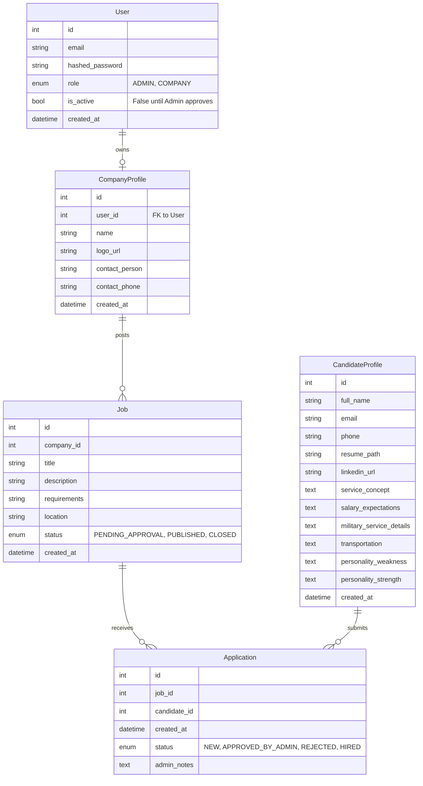

## Design Principles

- **Monolith First** – single deployable service with clear domain boundaries
- **Vertical Slices** – features are developed end-to-end
- **Admin as Gatekeeper** – all public data requires admin approval
- **Match is the Product** – the Application entity is the system core
- **Low friction MVP** – minimal auth surface, minimal public access
- **Future-ready** – decisions documented, refactors anticipated

---

## Authentication Model

### Hybrid Auth Model

- **Users** authenticate and log in
    - Admins
    - Companies
- **Candidates** do NOT authenticate
    - They are treated as leads / data entities
    - Future authentication is optional and non-breaking

This model reduces security risk and complexity while keeping the system flexible.

---

## Database Schema (ERD)

