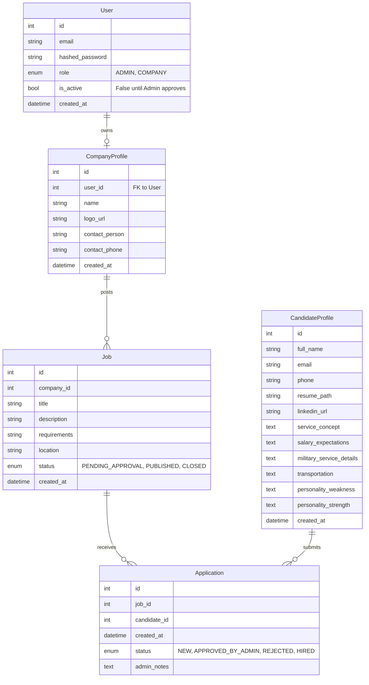

## Design Principles

- **Monolith First** – single deployable service with clear domain boundaries
- **Vertical Slices** – features are developed end-to-end
- **Admin as Gatekeeper** – all public data requires admin approval
- **Match is the Product** – the Application entity is the system core
- **Low friction MVP** – minimal auth surface, minimal public access
- **Future-ready** – decisions documented, refactors anticipated
- **Architecture-First** – critical infrastructure decisions made before dependent features

---

## Authentication Model

### Hybrid Auth Model

- **Users** authenticate and log in
    - Admins
    - Companies
- **Candidates** do NOT authenticate
    - They are treated as leads / data entities
    - Future authentication is optional and non-breaking

This model reduces security risk and complexity while keeping the system flexible.

---

## Critical Infrastructure Decisions

### 1. File Storage Strategy

**Problem:** `CandidateProfile.resume_path` implies file storage, but Docker containers are ephemeral. Local file storage will be lost on container restart/redeploy.

**Decision Required:** Choose persistent object storage solution before implementing Candidate slice.

**Options:**
- **AWS S3** – Production-ready, scalable, pay-per-use
- **Cloudinary** – Image/document optimization built-in
- **MinIO** – Self-hosted S3-compatible, good for dev/staging
- **Local Volume Mount** – Only for development, not production

**Recommendation:** Use MinIO for dev/staging (Docker-compatible), AWS S3 for production. Abstract storage behind a service interface to allow switching.

**Implementation:** `src/core/storage.py` with provider abstraction (S3/MinIO/Local).

---

### 2. Email/Notification Service

**Problem:** Notifications are scheduled late (Phase 4), but admins need real-time alerts when candidates apply. Without email service, admins must manually refresh dashboard.

**Decision Required:** Integrate email service early (Infrastructure phase) to enable notifications throughout the system.

**Options:**
- **SMTP (Gmail/SendGrid)** – Simple, reliable, works with any provider
- **SendGrid API** – Transactional email service, better deliverability
- **AWS SES** – Cost-effective at scale
- **Postmark** – Developer-friendly, great deliverability

**Recommendation:** Start with SendGrid (free tier: 100 emails/day) or SMTP. Move to AWS SES if scaling.

**Implementation:** `src/core/email.py` with async email sending. Integrate into Application creation flow (feat5) and Admin approval flows.

**Notification Triggers:**
- New candidate application → Email admin
- Company registration → Email admin (approval needed)
- Job posted → Email admin (approval needed)
- Application status changed → Email candidate/company

---

### 3. Frontend Architecture

**Problem:** Roadmap mentions "Public Job Board" and "Admin Dashboard" but doesn't specify if FastAPI serves HTML or acts as headless API.

**Decision Required:** Choose frontend architecture before building frontend (Section 5).

**Options:**

**A. Server-Side Rendering (SSR) with Jinja2**
- FastAPI serves HTML templates
- Simpler deployment (single service)
- SEO-friendly
- Less interactive, harder to scale frontend separately

**B. Separate SPA (React/Vue/Svelte)**
- FastAPI as headless API only
- Better UX, more interactive
- Separate deployment, CORS configuration needed
- Better for future mobile apps

**C. Hybrid (SSR + API)**
- FastAPI serves public pages (SSR)
- Admin/Company dashboards as SPA
- More complex but flexible

**Recommendation:** **Option B (Separate SPA)** – Better separation of concerns, easier to scale frontend independently, better UX for dashboards. Use React or Vue with TypeScript.

**API Structure:** All endpoints return JSON. Frontend consumes REST API with JWT authentication.

**CORS Configuration:** Since frontend and backend are separate services, CORS must be configured in FastAPI to allow frontend origin(s). This is a critical backend configuration step before frontend development begins.

---

### 5. CORS Configuration

**Problem:** With a separate SPA frontend, browsers enforce Same-Origin Policy. Frontend requests to backend API will be blocked unless CORS is properly configured.

**Decision Required:** Configure CORS middleware in FastAPI before frontend development starts.

**Configuration Requirements:**
- **Allowed Origins:**
  - Development: `http://localhost:3000` (or frontend dev server port)
  - Staging: Staging frontend URL
  - Production: Production frontend URL
- **Allowed Methods:** `GET`, `POST`, `PUT`, `PATCH`, `DELETE`, `OPTIONS`
- **Allowed Headers:** `Content-Type`, `Authorization` (for JWT tokens)
- **Credentials:** `True` (to allow cookies/auth headers)

**Implementation:**
- Use FastAPI's `CORSMiddleware` in `src/main.py`
- Environment-based origin configuration (dev/staging/prod)
- Secure defaults: Never use `allow_origins=["*"]` in production

**Example:**
```python
from fastapi.middleware.cors import CORSMiddleware

app.add_middleware(
    CORSMiddleware,
    allow_origins=settings.allowed_origins,  # From config
    allow_credentials=True,
    allow_methods=["*"],
    allow_headers=["*"],
)
```

**Security Considerations:**
- Whitelist specific origins, never use wildcard in production
- Use environment variables for origin configuration
- Test CORS in development before deploying

---

### 4. Database Backup Strategy

**Problem:** Production will use PostgreSQL. Docker volumes are insufficient for production safety. Need automated backup strategy to prevent data loss.

**Decision Required:** Define backup strategy before production deployment.

**Options:**
- **Automated PostgreSQL Backups** – pg_dump scheduled via cron/kubernetes job
- **Managed Database Service** – AWS RDS, DigitalOcean Managed DB (built-in backups)
- **Point-in-Time Recovery** – WAL archiving for PostgreSQL
- **Backup to S3** – Store dumps in object storage

**Recommendation:**
- **Development:** Manual backups or Docker volume snapshots
- **Staging/Production:** Use managed PostgreSQL (RDS/DO) with automated daily backups + point-in-time recovery
- **Backup Retention:** 7 days daily, 4 weeks weekly, 12 months monthly

**Implementation:**
- Document backup/restore procedures
- Test restore process regularly
- Monitor backup success/failure
- Store backups in separate region/account

---

## Database Schema (ERD)


