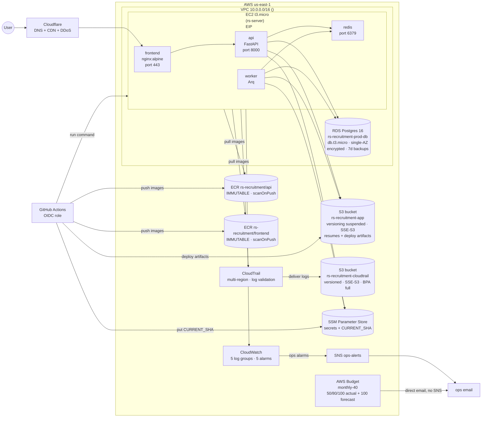
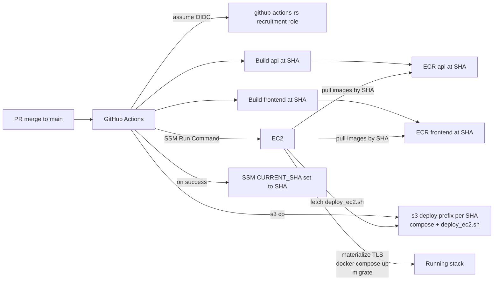

# Infrastructure — Current State

The single source of truth for what's deployed in AWS, how it fits together, and *why* it was built this way. Every PR that touches infra updates this file in the same PR.

For higher-level architectural decisions (auth model, framework choices, etc.) see [`ARCHITECTURE.md`](./ARCHITECTURE.md). For operational runbooks see the doc pages listed at the bottom.

**Account:** `<ACCOUNT_ID>` · **Region:** `us-east-1` · **Created:** 2026-01-14

---

## 1. Topology

### Network notes

- **Single VPC** (`<VPC_ID>`); default VPC was deleted 2026-05-09.
- **No NAT Gateway, no ALB, no CloudFront.** EC2 has an Elastic IP and reaches the internet via IGW. TLS terminates at the nginx container on the EC2.
- **DNS lives at Cloudflare**, not Route 53. The only Route 53 resource is one health check (`<R53_HC_ID>`) used by `rs-recruiting-uptime` alarm.
- **No ACM cert.** TLS cert + key live in SSM SecureString; materialized to a host bind-mount at deploy time.

### Security groups

| SG | Purpose | Ingress | Egress |
|---|---|---|---|
| `Web-SG` (`<WEB_SG_ID>`) | Public-facing on EC2 | `:443` from `0.0.0.0/0`, `:22` from `<ADMIN_IP>/32` | (default all-out) |
| `App-SG` (`<APP_SG_ID>`) | Inter-container on EC2 | `:8000` from Web-SG, `:6379` self-ref | `:443/80` to `0.0.0.0/0`, `:5432` to `0.0.0.0/0`, SMTP `:465/587` |
| `RDS-SG` (`<RDS_SG_ID>`) | RDS Postgres | `:5432` from App-SG | (default all-out) |
| `default` (`<DEFAULT_SG_ID>`) | VPC default — unused | (default self-ref) | (default all-out) |

Loose end: App-SG egress on `5432` is `0.0.0.0/0`; could be tightened to `RDS-SG` only. Tracked but not blocking.

---

## 2. Deploy pipeline

### Properties

- **Atomic artifact:** every deploy = 2 ECR images + 1 S3 prefix + 1 SSM pointer, all keyed by the same git SHA.
- **Per-SHA immutability:** S3 prefix `deploy/${SHA}/` is written once, never overwritten. ECR repos are `IMMUTABLE`. Together: no last-writer-wins overwrite of a previous deploy's artifacts.
- **Rollback:** `scripts/rollback.sh <SHA>` flips `CURRENT_SHA` and re-runs the SSM command against the older prefix.
- **Validation gate:** `scripts/validate_deploy_artifacts.sh` runs in CI and asserts the HTTPS contract (`listen 443 ssl`, `IMAGE_TAG` referenced, no `:latest` in compose, etc.) — see `validate_deploy_artifacts.sh` for the full list.

---

## 3. Resource inventory

### Compute & data
| Resource | Identifier | Notes |
|---|---|---|
| EC2 | `<EC2_INSTANCE_ID>` (t3.micro) | IMDSv2 required, basic monitoring, in `App-SG` + `Web-SG` |
| EBS root | `<EBS_VOL_ID>` (8 GB gp3) | **Unencrypted** (pre-default-encryption); account-default now ON; one-shot re-encryption pending |
| Elastic IP | `<ELASTIC_IP>` (`<EIP_ASSOC_ID>`) | Attached to EC2 |
| RDS | `rs-recruitment-prod-db` (db.t3.micro) | Postgres 16, single-AZ, encrypted, 7d backup retention, deletion protection ON, Performance Insights 7d, postgresql log export to CW |
| Key pair | `rs-recruitment-key` | EC2 SSH key |

### Storage
| Bucket / repo | Purpose | Settings |
|---|---|---|
| `<APP_BUCKET>` | App data — resumes (`resumes/`), public assets (`public/*`), deploy artifacts (`deploy/${SHA}/`) | **Versioning SUSPENDED** (was ON; suspended 2026-05-13 — see decisions log). SSE-S3. BPA partial (public path allowed for BIMI logo). **Lifecycle:** noncurrent versions expire after 1d; delete markers auto-cleaned (`ExpiredObjectDeleteMarker: true`); abort incomplete multipart 7d. Deploy artifact prefixes pruned to last 10 by CI post-deploy. |
| `<CLOUDTRAIL_BUCKET>` | CloudTrail logs | Versioning ON, SSE-S3, BPA full block |
| ECR `rs-recruitment/api` | Backend image | IMMUTABLE, scanOnPush, lifecycle "keep last 10 images" |
| ECR `rs-recruitment/frontend` | Frontend image (multistage build) | IMMUTABLE, scanOnPush, lifecycle "keep last 10 images" |

### IAM
| Principal | Type | What it does |
|---|---|---|
| `lahav-admin` | User | Console + CLI admin (MFA on) |
| `rs-recruitment-app-role` | EC2 instance profile | EC2-side: ECR pull, SSM read on `/rs-recruitment/*`, S3 `GetObject`/`PutObject`/`DeleteObject`/`DeleteObjectVersion`/`ListBucket`/`ListBucketVersions` on the app bucket, CW Logs write, namespace-scoped `cloudwatch:PutMetricData` for `RsRecruitment/Retention` |
| `github-actions-rs-recruitment` | GHA OIDC | CI: ECR push, S3 write to deploy prefix, SSM SendCommand + PutParameter on CURRENT_SHA |
| `github-role` | Older GHA role | Legacy — verify if still referenced; candidate for cleanup |
| `AWSDataLifecycleManagerDefaultRole` | Service | DLM weekly EC2 snapshot policy |
| `AWS-QuickSetup-SSM-*` | Service | SSM fleet manager quick-setup (unused) |

Account password policy: 14-char, mixed, 90-day rotation, 5-prev reuse-prevent.
Default EBS encryption: ON (account-wide).

### Configuration
| Resource | Notes |
|---|---|
| SSM `/rs-recruitment/prod/*` | App secrets (DATABASE_URL, JWT_SECRET_KEY, SMTP_*, STORAGE_PROVIDER, etc.) — SecureString where appropriate |
| SSM `/rs-recruitment/infra/CURRENT_SHA` | String — current deployed SHA (deploy version pointer) |
| SSM `/rs-recruitment/infra/TLS_CERT`, `TLS_KEY` | SecureString — TLS cert/key for the frontend nginx |
| KMS | 2 customer-managed keys (default RDS + SSM) |
| Route 53 | 1 health check; no hosted zones (DNS at Cloudflare) |

### Observability
| Resource | Settings |
|---|---|
| Log group `/rs-recruitment/api` | 14d retention |
| Log group `/rs-recruitment/nginx` | 14d retention |
| Log group `/rs-recruitment/redis` | 14d retention |
| Log group `/rs-recruitment/worker` | **400d retention** (compliance audit trail for `retention.purge candidate_id=`) |
| Log group `/aws/rds/instance/rs-recruitment-prod-db/postgresql` | RDS log export (default retention) |
| Alarm `ec2-cpu-high-rs-server` | EC2 CPU >80% for 30min → ops-alerts |
| Alarm `rds-cpu-high` | RDS CPU >80% for 30min → ops-alerts |
| Alarm `rds-storage-low` | RDS free storage <4GB → ops-alerts |
| Alarm `rs-recruiting-uptime` | Route53 health check failure → ops-alerts |
| Alarm `retention-purge-stale` | No `PurgedCandidatesCount` datapoint in 26h → ops-alerts (see `RETENTION_PURGE.md`) |
| SNS `ops-alerts` | Email → `<OPS_EMAIL>` (confirmed). Consumers: 5 ops alarms + EventBridge rule `guardduty-findings`. Topic policy explicitly allows `events.amazonaws.com` to publish. |
| CloudTrail `rs-recruitment-trail` | Multi-region, log file validation, → `rs-recruitment-cloudtrail-<ACCOUNT_ID>` |
| GuardDuty detector `<GUARDDUTY_DETECTOR_ID>` | ENABLED, 15-minute finding frequency, 30-day free trial active until ~2026-06-08; primary input is CloudTrail (above) |
| EventBridge rule `guardduty-findings` | Pattern: `source=aws.guardduty, detail-type=GuardDuty Finding`. Target: `ops-alerts` SNS with input transformer that flattens raw JSON into a human-readable email (severity, type, title, description, region, resource type) |
| AWS Budget `monthly-40` | $40/mo cost budget with **4 direct EMAIL subscriptions** (no SNS): 50%/80%/100% actual + 100% forecasted |

### Backup posture
| Layer | Mechanism | Retention |
|---|---|---|
| RDS | Automated daily snapshot | 7 days |
| EC2 root EBS | DLM policy `<DLM_POLICY_ID>` weekly | Last 4 |
| S3 (app bucket) | Versioning suspended — new writes get null version; `delete_file` purges all versions + markers explicitly | N/A (versioning off for new objects; lifecycle expires orphaned noncurrent versions within 1d) |
| S3 (CloudTrail bucket) | Versioning | All versions kept |

### Custom metrics namespace
| Namespace | Metric | Source |
|---|---|---|
| `RsRecruitment/Retention` | `PurgedCandidatesCount` | Worker — Arq cron, see `tasks.py::_emit_purge_count_metric` |

---

## 4. Decisions log (append-only)

Newest first. Each entry: date, what, why, links. When updating, append; don't rewrite history.

### 2026-05-13 — Permanent S3 file deletion + versioning suspended (PR [#406](https://github.com/lahavrud/rs-recruitment/pull/406))
**Decision:** (1) Suspend S3 versioning on the app bucket. (2) Add lifecycle rule: noncurrent versions expire after 1 day, delete markers auto-cleaned. (3) Update `S3StorageProvider.delete_file` to walk `list_object_versions` and call `delete_objects` with explicit VersionIds, permanently removing every version and marker rather than creating a new delete marker. (4) Extend `rs-recruitment-app-role` S3 policy with `s3:DeleteObjectVersion` and `s3:ListBucketVersions`.
**Why:** With versioning enabled, `delete_object` only inserts a delete marker — the actual object data remains. A live test confirmed that deleting a candidate left their resume version in S3 (observable via `list_object_versions`). Since all file keys include a UUID (no overwrite risk), versioning bought nothing for the app while making every delete a multi-step operation. Suspension + code-level permanent delete satisfies the 12-month retention policy's "data is gone" guarantee. Lifecycle rule is the safety net for any marker or version that pre-dates this change.
**Trade:** Can't fully disable versioning once enabled (AWS limitation) — suspension is the equivalent. The permanent-delete code path (version walk + `delete_objects`) is slightly more complex than a plain `delete_object` call, but remains correct on both suspended and fully-versioned buckets.

### 2026-05-09 — GuardDuty enabled, findings → ops-alerts via EventBridge transformer
**Decision:** Enable GuardDuty (15-minute publishing frequency, 30-day free trial), wire findings to the existing `ops-alerts` SNS topic via an EventBridge rule with an input transformer that flattens the raw finding JSON into a readable email summary (severity, type, title, description, region, resource type).
**Why:** CloudTrail is now writing API audit data, but no human reads CloudTrail manually. GuardDuty turns CloudTrail (+ DNS + EC2 metadata) into actionable signal — primarily catches credential abuse, which is the realistic threat at single-admin scale. The 30-day trial gives a real cost estimate before committing; if it lands above ~$5/mo or generates noise, can disable.
**Trade:** added one EventBridge rule + one new statement on the SNS topic policy (allow `events.amazonaws.com` to publish). VPC Flow Logs explicitly skipped — see prior entry.

### 2026-05-09 — Billing alerts via AWS Budget only; S3 lifecycle + cleanup
**Decision:** Delete the redundant CloudWatch `billing-over-40` alarm and `billing-alerts` SNS topic. AWS Budget `monthly-40` already has 4 direct EMAIL subscriptions (50%/80%/100% actual + 100% forecasted) that fire faster and with finer-grained thresholds than the alarm — keeping both was duplicate notifications. Net: one fewer alarm, one fewer SNS topic, only `ops-alerts` remains. Also cleaned up obsolete root-level S3 deploy artifacts (`deploy/{deploy_ec2.sh, docker-compose.deploy.yml, nginx.conf, dist/, seed_admin.py}` — all leftovers from the pre-#296 deploy model) and applied a lifecycle policy: `deploy/` current versions expire after 30 days (matches the spirit of ECR's "keep last 10 tagged" since deploys land near-daily), global noncurrent versions expire after 30 days, incomplete multipart uploads abort after 7 days.
**Why:** Surfaced when reviewing the topology diagram — billing alerts appeared to flow through SNS, but the actual budget mechanism is direct email. Same review caught that the bucket still had pre-atomic-deploy artifacts at the root level that nothing reads anymore.

### 2026-05-09 — GuardDuty over VPC Flow Logs
**Decision:** Enable GuardDuty (with EventBridge → ops-alerts), defer Flow Logs.
**Why:** At single-EC2 + Cloudflare-fronted scale, Flow Logs would be mostly noise from internet port-scans; the realistic incident response is "rotate keys, restore backup," not network forensics. GuardDuty fills the credential-leak detection gap that CloudTrail alone can't (no one reads CloudTrail manually).
**Trigger to revisit Flow Logs:** add a second EC2, NAT gateway, or land an enterprise customer requiring it.

### 2026-05-09 — CloudTrail in dedicated bucket
**Decision:** Multi-region trail with log file validation, in a separate dedicated bucket (BPA full block, versioning).
**Why:** Audit logs deserve a separate access boundary from app data. Dedicated bucket means a misconfigured S3 lifecycle on the app bucket can't expire audit logs.

### 2026-05-09 — Day 1 + Day 2 hardening
**Decision:** Delete `rs-app-dev` long-lived IAM key + wildcard policies; password policy; default EBS encryption; ECR `IMMUTABLE` + `scanOnPush`; alarm routing to `ops-alerts` (billing kept on `billing-alerts`); RDS Performance Insights + log exports; worker log retention 14→400 days; delete default VPC + orphan SGs.
**Why:** AWS audit pre-Day 3. Detail in this conversation; resource state above reflects post-change.
**Side-effect PR:** [#301](https://github.com/lahavrud/rs-recruitment/pull/301) dropped `:latest` push from CI to enable `IMMUTABLE`.

### 2026-05-09 — Audit log: DB-only with INSERT-only grants (Phase 1); S3 Object Lock deferred (Phase 2)
**Decision:** Keep PR [#300](https://github.com/lahavrud/rs-recruitment/pull/300)'s DB table as the source of truth. Add INSERT-only grants for the app role (issue [#303](https://github.com/lahavrud/rs-recruitment/issues/303), Phase 1). Defer S3 Object Lock + Firehose archive (Phase 2) until enterprise/regulator triggers it.
**Why not CloudWatch-only:** loses transactional consistency with the business operation — silent compliance gaps under failure. **Why not Object Lock today:** permanent commitment, ~1 day of work, no auditor asking right now.

### 2026-05-08 — Retention purge observability (PR [#298](https://github.com/lahavrud/rs-recruitment/pull/298), runbook in [#299](https://github.com/lahavrud/rs-recruitment/pull/299))
**Decision:** Emit `PurgedCandidatesCount` metric nightly (always — even count=0). Stale-purge alarm via missing data. New `ops-alerts` SNS topic for ops separately from billing. Per-candidate audit log line `retention.purge candidate_id=<id>` to `/rs-recruitment/worker` (later bumped to 400d retention).
**Why:** Compliance requires proving the purge ran; missing-data alarm catches dead worker / IAM regression.

### 2026-05-04 — Atomic deploy artifact (PR [#296](https://github.com/lahavrud/rs-recruitment/pull/296))
**Decision:** SHA-pinned ECR images for both api and frontend (`frontend/Dockerfile` multistage bakes `nginx.conf` + `dist/`). Per-SHA immutable S3 prefix `deploy/${SHA}/`. SSM `CURRENT_SHA` as version pointer. `scripts/rollback.sh` for one-shot SHA flip.
**Why:** 521 outage on 2026-05-04 was caused by stale-base push to `main` overwriting S3 deploy configs (last-writer-wins). Splitting the artifact across mutable S3 + ECR `:latest` allowed an old config + new image (or vice versa) to combine into untested state.

### 2026-05-04 — Nightly candidate retention purge (PR [#295](https://github.com/lahavrud/rs-recruitment/pull/295))
**Decision:** Arq cron at 03:00 UTC, eligibility = "every application is on a CLOSED job updated >365d ago AND not HIRED." Best-effort S3 resume delete + DB cascade. See [`RETENTION_PURGE.md`](./RETENTION_PURGE.md).
**Why:** Privacy policy commits to 12-month retention.

### Earlier infrastructure baseline (pre-2026-05)
- Cloudflare → single EC2 + managed RDS (cost-effective MVP shape)
- GitHub Actions OIDC role (no long-lived CI keys)
- SSM Parameter Store for secrets (TLS, DB URL, JWT, SMTP)
- DLM weekly EC2 snapshot, retain 4 (EBS PIT recovery)
- See [`ARCHITECTURE.md`](./ARCHITECTURE.md) for higher-level decisions

---

## 5. Maintenance rules

1. **Any PR that touches AWS infra updates this file in the same PR.** Inventory tables stay accurate; decisions log gets a new entry.
2. **No standalone "diagram refresh" PRs.** Drift means the doc is wrong; if it can't be kept current, delete it.
3. **Don't rewrite the decisions log.** Supersede with a new entry that references the older one.

---

## 6. Related docs

- [`ARCHITECTURE.md`](./ARCHITECTURE.md) — high-level decisions (auth, framework, schema)
- [`RETENTION_PURGE.md`](./RETENTION_PURGE.md) — runbook for the nightly purge cron
- [`API_DESIGN.md`](./API_DESIGN.md), [`CONTEXT.md`](./CONTEXT.md), [`ROADMAP.md`](./ROADMAP.md) — product / domain context
- [Issue #303](https://github.com/lahavrud/rs-recruitment/issues/303) — pending: audit-log tamper evidence (Phase 1: INSERT-only grants)
