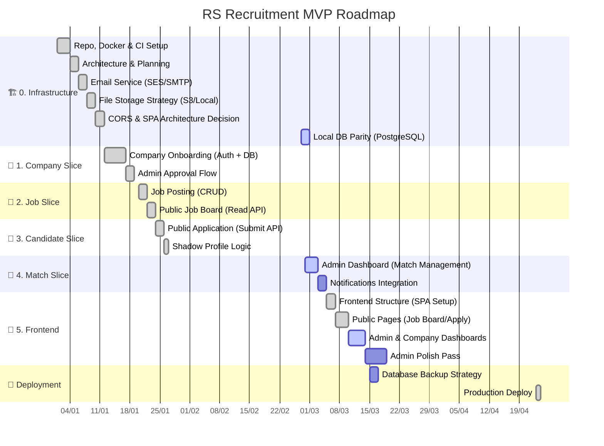

# 🗺️ Product Roadmap: RS Recruitment (MVP)

**Vision:** A specialized CRM for a boutique recruitment agency.

**Core Value:** Streamlining the flow from "Lead" (Job/Candidate) to "Match", with the Admin as the central gatekeeper.

---

## 🧭 Principles

* **Vertical Slices:** Develop features end-to-end (DB → Business Logic → API → Tests).
* **Admin as Gatekeeper:** All public data (Companies, Jobs, Matches) require Admin approval.
* **Hybrid Auth:** Admins & Companies are authenticated Users; Candidates are unauthenticated leads.
* **Backend-First Approach:** Complete backend API MVP before building frontend. Frontend consumes stable, tested APIs.
* **Architecture-First Decisions:** Critical infrastructure decisions (file storage, email, backups) must be made before dependent features.

---

## Development Timeline (Vertical Slices + DevOps)

**⚠️ Critical Dependencies:**

* `feat8` (Notifications) **requires** `infra5` (Email Service Integration).
* `frontend1` (Frontend Setup) **requires** `infra8` (CORS Configuration).
* `deploy1` (Production) **requires** `devops1` (Database Backup Strategy).

---

## Status Summary

### ✅ Completed

* **Infrastructure Abstraction**: Storage and Email providers are fully implemented with local and cloud support.
* **Core Vertical Slices**: Backend APIs for Authentication, Company Registration, Job Management, and Candidate Applications are complete and tested.
* **CI/CD & Validation**: Pipeline includes Ruff linting, Pytest, and custom scripts for Async safety and SOC enforcement.
* **Production Deploy (`deploy1`)**: Live at https://rs-recruiting.com (single EC2 + RDS + S3, deployed via GitHub Actions OIDC).
* **Frontend Foundation (`frontend1`, `frontend2`)**: SPA structure, auth, public job board, application submission flow, and admin / company page scaffolding.

### 🔄 In Progress

* **Admin & Company Dashboards (`frontend3`)**: 4 admin pages (Companies, Jobs, Applications, Candidates) and `CompanyJobsPage` exist as scaffolds with basic CRUD. Polish pass is the next phase.

### 📋 Next Priorities

1. **Admin Polish Pass (`frontend4`)**: Foundations (Dialog, toast, empty / skeleton / error states, search, infinite scroll, kebab menus), modal detail views per entity, full CRUD wiring, mobile layouts. Detailed plan in local working notes (not pushed).
2. **Notifications Integration (`feat8`)**: Candidate "application received" email + admin "new application" email via the Arq task queue.
3. **Backup Strategy (`devops1`)**: Automated PostgreSQL backups for production resilience.

### 📌 Deferred / post-MVP

* **Candidate edit & withdraw** (#610) — candidates can revise answers and resume while status=NEW, or withdraw the application entirely.
* **Candidate account deletion** (#611) — two-step GDPR right-to-be-forgotten: request → email confirmation → PII scrub + User hard-delete.
* **Admin candidate page updates** (#615) — surface linked-user status, tombstone display, admin-initiated deletion.
* **Company-side application visibility** — companies cannot yet view applications for their jobs.
* **Public job-board search / filters** and SEO (per-job meta, sitemap, JobPosting schema).
* **Admin shell redesign** (dashboard widgets, command palette, bulk actions) — defer until real usage data.
